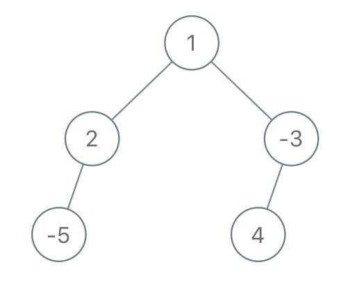

# 根到叶路径上的不足节点

给你二叉树的根节点 `root` 和一个整数 `limit` ，请你同时删除树中所有 **不足节点** ，并返回最终二叉树的根节点。

假如通过节点 `node` 的每种可能的 “根-叶” 路径上值的总和全都小于给定的 `limit`，则该节点被称之为 **不足节点** ，需要被删除。

**叶子节点**，就是没有子节点的节点。

**示例 1：**


``` javascript
输入：root = [1,2,3,4,-99,-99,7,8,9,-99,-99,12,13,-99,14], limit = 1
输出：[1,2,3,4,null,null,7,8,9,null,14]
```

**示例 2：**


``` javascript
输入：root = [5,4,8,11,null,17,4,7,1,null,null,5,3], limit = 22
输出：[5,4,8,11,null,17,4,7,null,null,null,5]
```

**示例 3：**



``` javascript
输入：root = [1,2,-3,-5,null,4,null], limit = -1
输出：[1,null,-3,4]
```

**提示：**

- 树中节点数目在范围 `[1, 5000]` 内
- `-10^5 <= Node.val <= 10^5`
- `-10^9 <= limit <= 10^9`

**解答：**

**#**|**编程语言**|**时间（ms / %）**|**内存（MB / %）**|**代码**
--|--|--|--|--
1|javascript|?? / ??|?? / ??|[??](./javascript/ac_v1.js)

来源：力扣（LeetCode）

链接：https://leetcode.cn/problems/insufficient-nodes-in-root-to-leaf-paths

著作权归领扣网络所有。商业转载请联系官方授权，非商业转载请注明出处。
