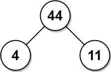

# 叶值的最小代价生成树

给你一个正整数数组 `arr`，考虑所有满足以下条件的二叉树：

- 每个节点都有 `0` 个或是 `2` 个子节点。
- 数组 `arr` 中的值与树的中序遍历中每个叶节点的值一一对应。
- 每个非叶节点的值等于其左子树和右子树中叶节点的最大值的乘积。

在所有这样的二叉树中，返回每个非叶节点的值的最小可能总和。这个和的值是一个 32 位整数。

如果一个节点有 0 个子节点，那么该节点为叶节点。

**示例 1：**


``` javascript
输入：arr = [6,2,4]
输出：32
解释：有两种可能的树，第一种的非叶节点的总和为 36 ，第二种非叶节点的总和为 32 。
```

**示例 2：**



``` javascript
输入：arr = [4,11]
输出：44
```

**提示：**

- `2 <= arr.length <= 40`
- `1 <= arr[i] <= 15`
- 答案保证是一个 32 位带符号整数，即小于 `2^31` 。

**解答：**

**#**|**编程语言**|**时间（ms / %）**|**内存（MB / %）**|**代码**
--|--|--|--|--
1|javascript|56 / 100.00|41.1 / 90.91|[优先队列](./javascript/ac_v1.js)

来源：力扣（LeetCode）

链接：https://leetcode.cn/problems/minimum-cost-tree-from-leaf-values

著作权归领扣网络所有。商业转载请联系官方授权，非商业转载请注明出处。
