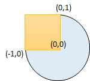

# 圆和矩形是否有重叠

给你一个以 `(radius, xCenter, yCenter)` 表示的圆和一个与坐标轴平行的矩形 `(x1, y1, x2, y2)` ，其中 `(x1, y1)` 是矩形左下角的坐标，而 `(x2, y2)` 是右上角的坐标。

如果圆和矩形有重叠的部分，请你返回 `true` ，否则返回 `false` 。

换句话说，请你检测是否 **存在** 点 `(xi, yi)` ，它既在圆上也在矩形上（两者都包括点落在边界上的情况）。

**示例 1 ：**


``` javascript
输入：radius = 1, xCenter = 0, yCenter = 0, x1 = 1, y1 = -1, x2 = 3, y2 = 1
输出：true
解释：圆和矩形存在公共点 (1,0) 。
```

**示例 2 ：**

``` javascript
输入：radius = 1, xCenter = 1, yCenter = 1, x1 = 1, y1 = -3, x2 = 2, y2 = -1
输出：false
```

**示例 3 ：**



``` javascript
输入：radius = 1, xCenter = 0, yCenter = 0, x1 = -1, y1 = 0, x2 = 0, y2 = 1
输出：true
```

**提示：**

- `1 <= radius <= 2000`
- `-10^4 <= xCenter, yCenter <= 10^4`
- `-10^4 <= x1 < x2 <= 10^4`
- `-10^4 <= y1 < y2 <= 10^4`

**解答：**

**#**|**编程语言**|**时间（ms / %）**|**内存（MB / %）**|**代码**
--|--|--|--|--
1|javascript|?? / ??|?? / ??|[??](./javascript/ac_v1.js)

来源：力扣（LeetCode）

链接：https://leetcode.cn/problems/circle-and-rectangle-overlapping

著作权归领扣网络所有。商业转载请联系官方授权，非商业转载请注明出处。
