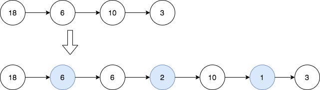

# 在链表中插入最大公约数

给你一个链表的头 `head` ，每个结点包含一个整数值。

在相邻结点之间，请你插入一个新的结点，结点值为这两个相邻结点值的 **最大公约数** 。

请你返回插入之后的链表。

两个数的 **最大公约数** 是可以被两个数字整除的最大正整数。

**示例 1：**



``` javascript
输入：head = [18,6,10,3]
输出：[18,6,6,2,10,1,3]
解释：第一幅图是一开始的链表，第二幅图是插入新结点后的图（蓝色结点为新插入结点）。
- 18 和 6 的最大公约数为 6 ，插入第一和第二个结点之间。
- 6 和 10 的最大公约数为 2 ，插入第二和第三个结点之间。
- 10 和 3 的最大公约数为 1 ，插入第三和第四个结点之间。
所有相邻结点之间都插入完毕，返回链表。
```

**示例 2：**


``` javascript
输入：head = [7]
输出：[7]
解释：第一幅图是一开始的链表，第二幅图是插入新结点后的图（蓝色结点为新插入结点）。
没有相邻结点，所以返回初始链表。
```

**提示：**

- 链表中结点数目在 `[1, 5000]` 之间。
- `1 <= Node.val <= 1000`

**解答：**

**#**|**编程语言**|**时间（ms / %）**|**内存（MB / %）**|**代码**
--|--|--|--|--
1|javascript|100 / 71.43|56.48 / 9.52|[gcd](./javascript/ac_v1.js)

来源：力扣（LeetCode）

链接：https://leetcode.cn/problems/insert-greatest-common-divisors-in-linked-list

著作权归领扣网络所有。商业转载请联系官方授权，非商业转载请注明出处。
