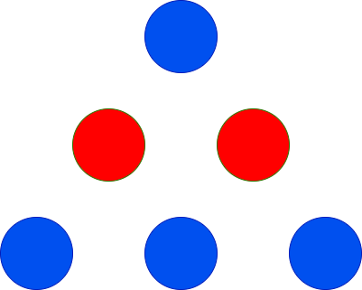

# 三角形的最大高度

给你两个整数 `red` 和 `blue`，分别表示红色球和蓝色球的数量。你需要使用这些球来组成一个三角形，满足第 1 行有 1 个球，第 2 行有 2 个球，第 3 行有 3 个球，依此类推。

每一行的球必须是 **相同** 颜色，且相邻行的颜色必须 **不同**。

返回可以实现的三角形的 **最大** 高度。

**示例 1：**

``` javascript
输入： red = 2, blue = 4

输出： 3

解释：
```



``` javascript
上图显示了唯一可能的排列方式。
```

**示例 2：**

``` javascript
输入： red = 2, blue = 1

输出： 2

解释：
```


``` javascript
上图显示了唯一可能的排列方式。
```

**示例 3：**

``` javascript
输入： red = 1, blue = 1

输出： 1
```

**示例 4：**

``` javascript
输入： red = 10, blue = 1

输出： 2

解释：
```


``` javascript
上图显示了唯一可能的排列方式。
```

**提示：**

- `1 <= red, blue <= 100`

**解答：**

**#**|**编程语言**|**时间（ms / %）**|**内存（MB / %）**|**代码**
--|--|--|--|--
1|javascript|80 / 26.59|50.10 / 83.53|[朴素方法](./javascript/ac_v1.js)

来源：力扣（LeetCode）

链接：https://leetcode.cn/problems/maximum-height-of-a-triangle

著作权归领扣网络所有。商业转载请联系官方授权，非商业转载请注明出处。
