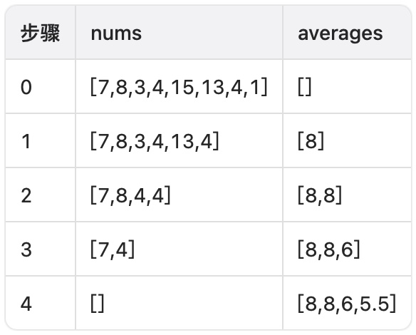
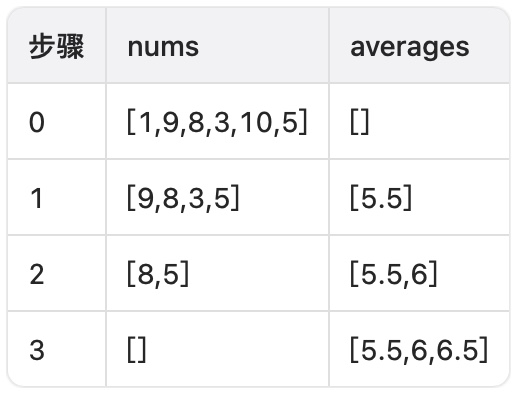
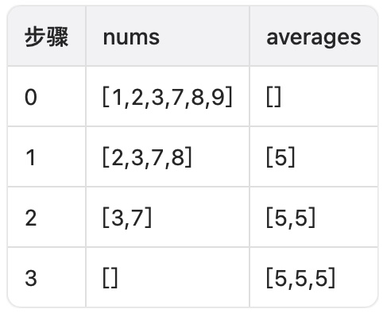

# 最小元素和最大元素的最小平均值

你有一个初始为空的浮点数数组 `averages`。另给你一个包含 `n` 个整数的数组 `nums`，其中 `n` 为偶数。

你需要重复以下步骤 `n / 2` 次：

- 从 `nums` 中移除 **最小** 的元素 `minElement` 和 **最大** 的元素 `maxElement`。
- 将 `(minElement + maxElement) / 2` 加入到 `averages` 中。

返回 `averages` 中的 **最小** 元素。

**示例 1：**

``` javascript
输入： nums = [7,8,3,4,15,13,4,1]

输出： 5.5

解释：
```



``` javascript
返回 averages 中最小的元素，即 5.5。
```

**示例 2：**

``` javascript
输入： nums = [1,9,8,3,10,5]

输出： 5.5

解释：
```



**示例 3：**

``` javascript
输入： nums = [1,2,3,7,8,9]

输出： 5.0

解释：
```




**提示：**

- `2 <= n == nums.length <= 50`
- `n` 为偶数。
- `1 <= nums[i] <= 50`

**解答：**

**#**|**编程语言**|**时间（ms / %）**|**内存（MB / %）**|**代码**
--|--|--|--|--
1|javascript|70 / 72.70|50.83 / 98.75|[朴素方法](./javascript/ac_v1.js)

来源：力扣（LeetCode）

链接：https://leetcode.cn/problems/minimum-average-of-smallest-and-largest-elements

著作权归领扣网络所有。商业转载请联系官方授权，非商业转载请注明出处。
