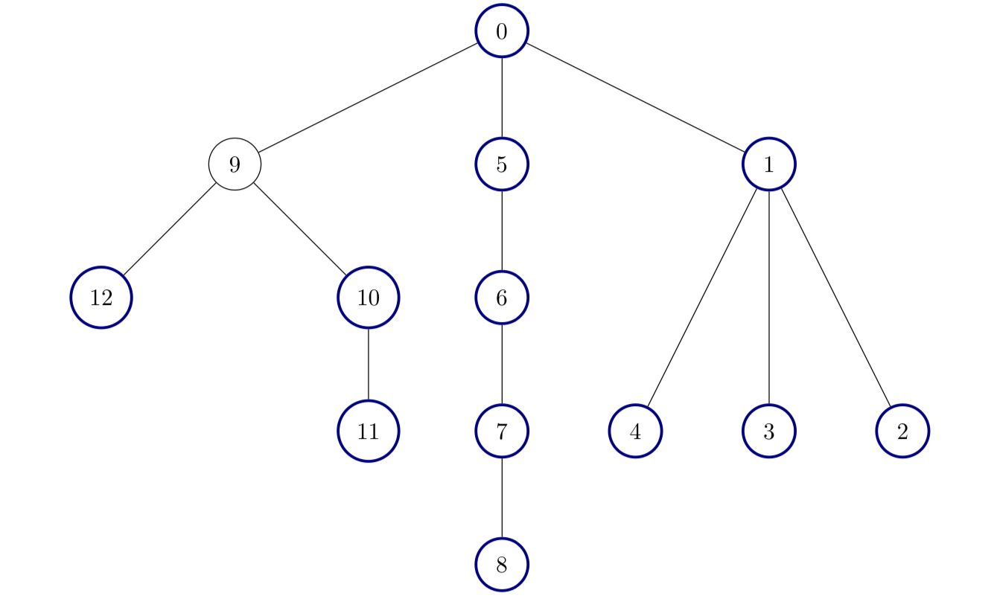

# 统计好节点的数目

现有一棵 **无向** 树，树中包含 `n` 个节点，按从 `0` 到 `n - 1` 标记。树的根节点是节点 `0` 。给你一个长度为 `n - 1` 的二维整数数组 `edges`，其中 `edges[i] = [ai, bi]` 表示树中节点 `ai` 与节点 `bi` 之间存在一条边。

如果一个节点的所有子节点为根的 **子树** 包含的节点数相同，则认为该节点是一个 **好节点**。

返回给定树中 **好节点** 的数量。

**子树** 指的是一个节点以及它所有后代节点构成的一棵树。

**示例 1：**

``` javascript
输入：edges = [[0,1],[0,2],[1,3],[1,4],[2,5],[2,6]]

输出：7

说明：
```


``` javascript
树的所有节点都是好节点。
```

**示例 2：**

``` javascript
输入：edges = [[0,1],[1,2],[2,3],[3,4],[0,5],[1,6],[2,7],[3,8]]

输出：6

说明：
```


``` javascript
树中有 6 个好节点。上图中已将这些节点着色。
```

**示例 3：**

``` javascript
输入：edges = [[0,1],[1,2],[1,3],[1,4],[0,5],[5,6],[6,7],[7,8],[0,9],[9,10],[9,12],[10,11]]

输出：12

解释：
```



``` javascript
除了节点 9 以外其他所有节点都是好节点。
```

**提示：**

- `2 <= n <= 10^5`
- `edges.length == n - 1`
- `edges[i].length == 2`
- `0 <= ai, bi < n`
- 输入确保 `edges` 总表示一棵有效的树。

**解答：**

**#**|**编程语言**|**时间（ms / %）**|**内存（MB / %）**|**代码**
--|--|--|--|--
1|javascript|439 / 94.98|119.40 / 94.30|[深度优先](./javascript/ac_v1.js)

来源：力扣（LeetCode）

链接：https://leetcode.cn/problems/count-the-number-of-good-nodes

著作权归领扣网络所有。商业转载请联系官方授权，非商业转载请注明出处。
