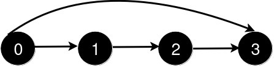

# 新增道路查询后的最短距离 I

给你一个整数 `n` 和一个二维整数数组 `queries`。

有 `n` 个城市，编号从 `0` 到 `n - 1`。初始时，每个城市 `i` 都有一条单向道路通往城市 `i + 1`（ `0 <= i < n - 1`）。

`queries[i] = [ui, vi]` 表示新建一条从城市 `ui` 到城市 `vi` 的单向道路。每次查询后，你需要找到从城市 `0` 到城市 `n - 1` 的 **最短路径的长度**。

返回一个数组 `answer`，对于范围 `[0, queries.length - 1]` 中的每个 `i`，`answer[i]` 是处理完前 `i + 1` 个查询后，从城市 `0` 到城市 `n - 1` 的最短路径的长度。

**示例 1：**

``` javascript
输入： n = 5, queries = [[2, 4], [0, 2], [0, 4]]

输出： [3, 2, 1]

解释：
```


``` javascript
新增一条从 2 到 4 的道路后，从 0 到 4 的最短路径长度为 3。
```


``` javascript
新增一条从 0 到 2 的道路后，从 0 到 4 的最短路径长度为 2。
```


``` javascript
新增一条从 0 到 4 的道路后，从 0 到 4 的最短路径长度为 1。
```

**示例 2：**

``` javascript
输入： n = 4, queries = [[0, 3], [0, 2]]

输出： [1, 1]

解释：
```



``` javascript
新增一条从 0 到 3 的道路后，从 0 到 3 的最短路径长度为 1。
```


``` javascript
新增一条从 0 到 2 的道路后，从 0 到 3 的最短路径长度仍为 1。
```

**提示：**

- `3 <= n <= 500`
- `1 <= queries.length <= 500`
- `queries[i].length == 2`
- `0 <= queries[i][0] < queries[i][1] < n`
- `1 < queries[i][1] - queries[i][0]`
- 查询中没有重复的道路。

**解答：**

**#**|**编程语言**|**时间（ms / %）**|**内存（MB / %）**|**代码**
--|--|--|--|--
1|javascript|177 / 25.80|58.55 / 74.93|[广度优先](./javascript/ac_v1.js)

来源：力扣（LeetCode）

链接：https://leetcode.cn/problems/shortest-distance-after-road-addition-queries-i

著作权归领扣网络所有。商业转载请联系官方授权，非商业转载请注明出处。
