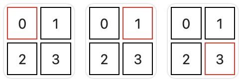
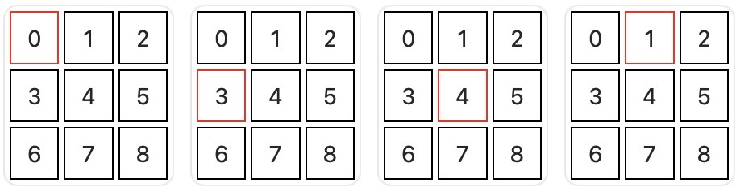

# 矩阵中的蛇

大小为 `n x n` 的矩阵 `grid` 中有一条蛇。蛇可以朝 **四个可能的方向** 移动。矩阵中的每个单元格都使用位置进行标识： `grid[i][j] = (i * n) + j`。

蛇从单元格 `0` 开始，并遵循一系列命令移动。

给你一个整数 `n` 表示 `grid` 的大小，另给你一个字符串数组 `commands`，其中包括 `"UP"`、`"RIGHT"`、`"DOWN"` 和 `"LEFT"`。题目测评数据保证蛇在整个移动过程中将始终位于 `grid` 边界内。

返回执行 `commands` 后蛇所停留的最终单元格的位置。

**示例 1：**

``` javascript
输入：n = 2, commands = ["RIGHT","DOWN"]

输出：3

解释：
```



**示例 2：**
``` javascript
输入：n = 3, commands = ["DOWN","RIGHT","UP"]

输出：1

解释：
```



**提示：**

- `2 <= n <= 10`
- `1 <= commands.length <= 100`
- `commands` 仅由 `"UP"`、`"RIGHT"`、`"DOWN"` 和 `"LEFT"` 组成。
- 生成的测评数据确保蛇不会移动到矩阵的边界外。

**解答：**

**#**|**编程语言**|**时间（ms / %）**|**内存（MB / %）**|**代码**
--|--|--|--|--
1|javascript|3 / 52.58|53.34 / 61.37|[朴素方法](./javascript/ac_v1.js)

来源：力扣（LeetCode）

链接：https://leetcode.cn/problems/snake-in-matrix

著作权归领扣网络所有。商业转载请联系官方授权，非商业转载请注明出处。
