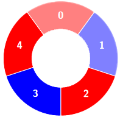
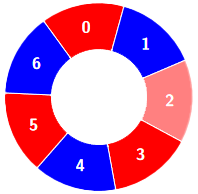

# 交替组 II

给你一个整数数组 `colors` 和一个整数 `k` ，`colors` 表示一个由红色和蓝色瓷砖组成的环，第 `i` 块瓷砖的颜色为 `colors[i]` ：

- `colors[i] == 0` 表示第 `i` 块瓷砖的颜色是 **红色** 。
- `colors[i] == 1` 表示第 `i` 块瓷砖的颜色是 **蓝色** 。

环中连续 `k` 块瓷砖的颜色如果是 **交替** 颜色（也就是说除了第一块和最后一块瓷砖以外，中间瓷砖的颜色与它 **左边** 和 **右边** 的颜色都不同），那么它被称为一个 **交替** 组。

请你返回 **交替** 组的数目。

**注意** ，由于 `colors` 表示一个 **环** ，**第一块** 瓷砖和 **最后一块** 瓷砖是相邻的。

**示例 1：**

``` javascript
输入：colors = [0,1,0,1,0], k = 3

输出：3

解释：
```


``` javascript
交替组包括：
```





**示例 2：**

``` javascript
输入：colors = [0,1,0,0,1,0,1], k = 6

输出：2

解释：
```


``` javascript
交替组包括：
```




**示例 3：**

``` javascript
输入：colors = [1,1,0,1], k = 4

输出：0

解释：
```


**提示：**

- `3 <= colors.length <= 10^5`
- `0 <= colors[i] <= 1`
- `3 <= k <= colors.length`

**解答：**

**#**|**编程语言**|**时间（ms / %）**|**内存（MB / %）**|**代码**
--|--|--|--|--
1|javascript|3 / 97.77|58.02 / 52.90|[计数](./javascript/ac_v1.js)

来源：力扣（LeetCode）

链接：https://leetcode.cn/problems/alternating-groups-ii

著作权归领扣网络所有。商业转载请联系官方授权，非商业转载请注明出处。
