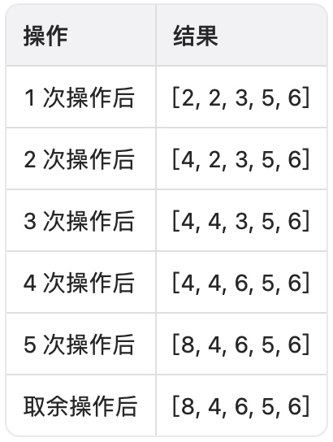
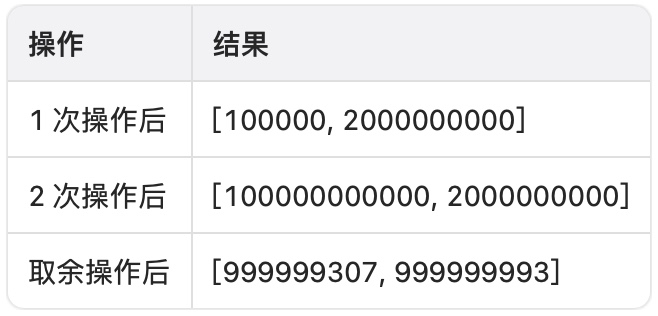

# K 次乘运算后的最终数组 II

给你一个整数数组 `nums` ，一个整数 `k` 和一个整数 `multiplier` 。

你需要对 `nums` 执行 `k` 次操作，每次操作中：

- 找到 `nums` 中的 **最小** 值 `x` ，如果存在多个最小值，选择最 **前面** 的一个。
- 将 `x` 替换为 `x * multiplier` 。

`k` 次操作以后，你需要将 `nums` 中每一个数值对 `10^9 + 7` 取余。

请你返回执行完 `k` 次乘运算以及取余运算之后，最终的 `nums` 数组。

**示例 1：**

``` javascript
输入：nums = [2,1,3,5,6], k = 5, multiplier = 2

输出：[8,4,6,5,6]

解释：
```



**示例 2：**

``` javascript
输入：nums = [100000,2000], k = 2, multiplier = 1000000

输出：[999999307,999999993]

解释：
```



**提示：**

- `1 <= nums.length <= 10^4`
- `1 <= nums[i] <= 10^9`
- `1 <= k <= 10^9`
- `1 <= multiplier <= 10^6`

**解答：**

**#**|**编程语言**|**时间（ms / %）**|**内存（MB / %）**|**代码**
--|--|--|--|--
1|javascript|?? / ??|?? / ??|[??](./javascript/ac_v1.js)

来源：力扣（LeetCode）

链接：https://leetcode.cn/problems/final-array-state-after-k-multiplication-operations-ii

著作权归领扣网络所有。商业转载请联系官方授权，非商业转载请注明出处。
