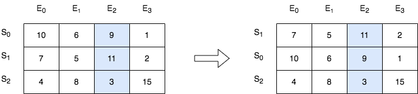

# 根据第 K 场考试的分数排序

班里有 `m` 位学生，共计划组织 `n` 场考试。给你一个下标从 **0** 开始、大小为 `m x n` 的整数矩阵 `score` ，其中每一行对应一位学生，而 `score[i][j]` 表示第 `i` 位学生在第 `j` 场考试取得的分数。矩阵 `score` 包含的整数 **互不相同** 。

另给你一个整数 `k` 。请你按第 `k` 场考试分数从高到低完成对这些学生（矩阵中的行）的排序。

返回排序后的矩阵。

**示例 1：**



``` javascript
输入：score = [[10,6,9,1],[7,5,11,2],[4,8,3,15]], k = 2
输出：[[7,5,11,2],[10,6,9,1],[4,8,3,15]]
解释：在上图中，S 表示学生，E 表示考试。
- 下标为 1 的学生在第 2 场考试取得的分数为 11 ，这是考试的最高分，所以 TA 需要排在第一。
- 下标为 0 的学生在第 2 场考试取得的分数为 9 ，这是考试的第二高分，所以 TA 需要排在第二。
- 下标为 2 的学生在第 2 场考试取得的分数为 3 ，这是考试的最低分，所以 TA 需要排在第三。
```

**示例 2：**


``` javascript
输入：score = [[3,4],[5,6]], k = 0
输出：[[5,6],[3,4]]
解释：在上图中，S 表示学生，E 表示考试。
- 下标为 1 的学生在第 0 场考试取得的分数为 5 ，这是考试的最高分，所以 TA 需要排在第一。
- 下标为 0 的学生在第 0 场考试取得的分数为 3 ，这是考试的最低分，所以 TA 需要排在第二。
```

**提示：**

- `m == score.length`
- `n == score[i].length`
- `1 <= m, n <= 250`
- `1 <= score[i][j] <= 10^5`
- `score` 由 **不同** 的整数组成
- `0 <= k < n`

**解答：**

**#**|**编程语言**|**时间（ms / %）**|**内存（MB / %）**|**代码**
--|--|--|--|--
1|javascript|1 / 75.00|59.61 / 81.48|[朴素方法](./javascript/ac_v1.js)

来源：力扣（LeetCode）

链接：https://leetcode.cn/problems/sort-the-students-by-their-kth-score

著作权归领扣网络所有。商业转载请联系官方授权，非商业转载请注明出处。
