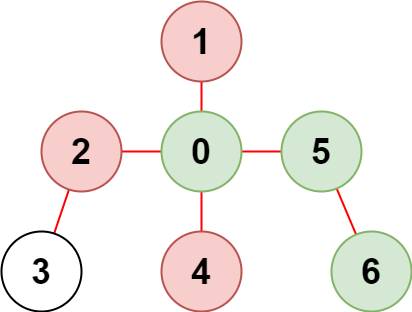

# 受限条件下可到达节点的数目

现有一棵由 `n` 个节点组成的无向树，节点编号从 `0` 到 `n - 1` ，共有 `n - 1` 条边。

给你一个二维整数数组 `edges` ，长度为 `n - 1` ，其中 `edges[i] = [ai, bi]` 表示树中节点 `ai` 和 `bi` 之间存在一条边。另给你一个整数数组 `restricted` 表示 **受限** 节点。

在不访问受限节点的前提下，返回你可以从节点 `0` 到达的 **最多** 节点数目。

注意，节点 `0` **不** 会标记为受限节点。

**示例 1：**


``` javascript
输入：n = 7, edges = [[0,1],[1,2],[3,1],[4,0],[0,5],[5,6]], restricted = [4,5]
输出：4
解释：上图所示正是这棵树。
在不访问受限节点的前提下，只有节点 [0,1,2,3] 可以从节点 0 到达。
```

**示例 2：**



``` javascript
输入：n = 7, edges = [[0,1],[0,2],[0,5],[0,4],[3,2],[6,5]], restricted = [4,2,1]
输出：3
解释：上图所示正是这棵树。
在不访问受限节点的前提下，只有节点 [0,5,6] 可以从节点 0 到达。
```

**提示：**

- `2 <= n <= 10^5`
- `edges.length == n - 1`
- `edges[i].length == 2`
- `0 <= ai, bi < n`
- `ai != bi`
- `edges` 表示一棵有效的树
- `1 <= restricted.length < n`
- `1 <= restricted[i] < n`
- `restricted` 中的所有值 **互不相同**

**解答：**

**#**|**编程语言**|**时间（ms / %）**|**内存（MB / %）**|**代码**
--|--|--|--|--
1|javascript|437 / 25.00|112.88 / 50.00|[广度优先](./javascript/ac_v1.js)

来源：力扣（LeetCode）

链接：https://leetcode.cn/problems/reachable-nodes-with-restrictions

著作权归领扣网络所有。商业转载请联系官方授权，非商业转载请注明出处。
