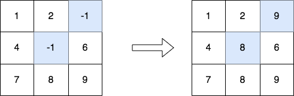
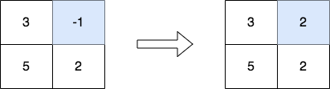

# 修改矩阵

给你一个下标从 **0** 开始、大小为 `m x n` 的整数矩阵 `matrix` ，新建一个下标从 **0** 开始、名为 `answer` 的矩阵。使 `answer` 与 `matrix` 相等，接着将其中每个值为 `-1` 的元素替换为所在列的 **最大** 元素。

返回矩阵 `answer` 。

**示例 1：**



``` javascript
输入：matrix = [[1,2,-1],[4,-1,6],[7,8,9]]
输出：[[1,2,9],[4,8,6],[7,8,9]]
解释：上图显示了发生替换的元素（蓝色区域）。
- 将单元格 [1][1] 中的值替换为列 1 中的最大值 8 。
- 将单元格 [0][2] 中的值替换为列 2 中的最大值 9 。
```

**示例 2：**



``` javascript
输入：matrix = [[3,-1],[5,2]]
输出：[[3,2],[5,2]]
解释：上图显示了发生替换的元素（蓝色区域）。
```

**提示：**

- `m == matrix.length`
- `n == matrix[i].length`
- `2 <= m, n <= 50`
- `-1 <= matrix[i][j] <= 100`
- 测试用例中生成的输入满足每列至少包含一个非负整数。

**解答：**

**#**|**编程语言**|**时间（ms / %）**|**内存（MB / %）**|**代码**
--|--|--|--|--
1|javascript|87 / 27.03|53.40 / 32.43|[朴素方法](./javascript/ac_v1.js)

来源：力扣（LeetCode）

链接：https://leetcode.cn/problems/modify-the-matrix

著作权归领扣网络所有。商业转载请联系官方授权，非商业转载请注明出处。
