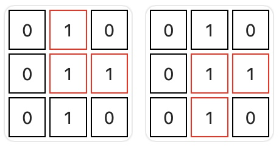
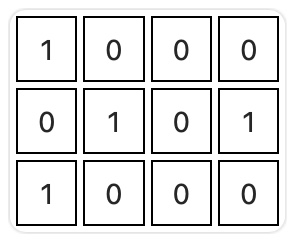
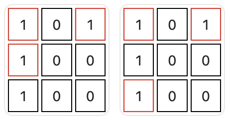

# 直角三角形

给你一个二维 boolean 矩阵 `grid` 。

请你返回使用 `grid` 中的 3 个元素可以构建的 **直角三角形** 数目，且满足 3 个元素值 **都** 为 1 。

**注意：**

- 如果 `grid` 中 3 个元素满足：一个元素与另一个元素在 **同一行**，同时与第三个元素在 **同一列** ，那么这 3 个元素称为一个 **直角三角形** 。这 3 个元素互相之间不需要相邻。

**示例 1：**



``` javascript
输入：grid = [[0,1,0],[0,1,1],[0,1,0]]

输出：2

解释：

有 2 个直角三角形。
```

**示例 2：**



``` javascript
输入：grid = [[1,0,0,0],[0,1,0,1],[1,0,0,0]]

输出：0

解释：

没有直角三角形。
```

**示例 3：**



``` javascript
输入：grid = [[1,0,1],[1,0,0],[1,0,0]]

输出：2

解释：

有两个直角三角形。
```

**提示：**

- `1 <= grid.length <= 1000`
- `1 <= grid[i].length <= 1000`
- `0 <= grid[i][j] <= 1`

**解答：**

**#**|**编程语言**|**时间（ms / %）**|**内存（MB / %）**|**代码**
--|--|--|--|--
1|javascript|160 / 57.14|77.00 / 65.08|[朴素方法](./javascript/ac_v1.js)

来源：力扣（LeetCode）

链接：https://leetcode.cn/problems/right-triangles

著作权归领扣网络所有。商业转载请联系官方授权，非商业转载请注明出处。
