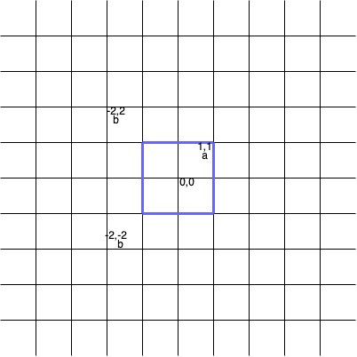

# 正方形中的最多点数

给你一个二维数组 `points` 和一个字符串 `s` ，其中 `points[i]` 表示第 `i` 个点的坐标，`s[i]` 表示第 `i` 个点的 **标签** 。

如果一个正方形的中心在 `(0, 0)` ，所有边都平行于坐标轴，且正方形内 不 存在标签相同的两个点，那么我们称这个正方形是 **合法** 的。

请你返回 **合法** 正方形中可以包含的 **最多** 点数。

**注意：**

- 如果一个点位于正方形的边上或者在边以内，则认为该点位于正方形内。
- 正方形的边长可以为零。

**示例 1：**


``` javascript
输入：points = [[2,2],[-1,-2],[-4,4],[-3,1],[3,-3]], s = "abdca"

输出：2

解释：

边长为 4 的正方形包含两个点 points[0] 和 points[1] 。
```

**示例 2：**



``` javascript
输入：points = [[1,1],[-2,-2],[-2,2]], s = "abb"

输出：1

解释：

边长为 2 的正方形包含 1 个点 points[0] 。
```

**示例 3：**

``` javascript
输入：points = [[1,1],[-1,-1],[2,-2]], s = "ccd"

输出：0

解释：

任何正方形都无法只包含 points[0] 和 points[1] 中的一个点，所以合法正方形中都不包含任何点。
```

**提示：**

- `1 <= s.length, points.length <= 10^5`
- `points[i].length == 2`
- `-10^9 <= points[i][0], points[i][1] <= 10^9`
- `s.length == points.length`
- `points` 中的点坐标互不相同。
- `s` 只包含小写英文字母。

**解答：**

**#**|**编程语言**|**时间（ms / %）**|**内存（MB / %）**|**代码**
--|--|--|--|--
1|javascript|129 / 92.59|73.95 / 98.15|[标签最小半径](./javascript/ac_v1.js)

来源：力扣（LeetCode）

链接：https://leetcode.cn/problems/maximum-points-inside-the-square

著作权归领扣网络所有。商业转载请联系官方授权，非商业转载请注明出处。
