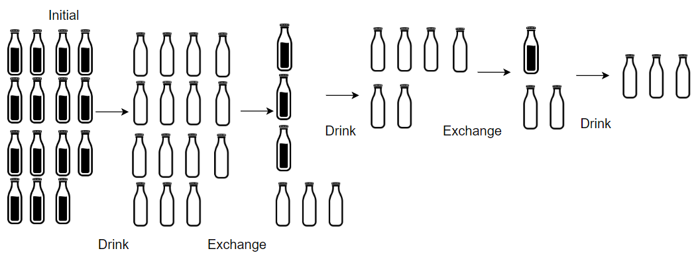

# 换水问题

超市正在促销，你可以用 `numExchange` 个空水瓶从超市兑换一瓶水。最开始，你一共购入了 `numBottles` 瓶水。

如果喝掉了水瓶中的水，那么水瓶就会变成空的。

给你两个整数 `numBottles` 和 `numExchange` ，返回你 **最多** 可以喝到多少瓶水。

**示例 1：**


``` javascript
输入：numBottles = 9, numExchange = 3
输出：13
解释：你可以用 3 个空瓶兑换 1 瓶水。
所以最多能喝到 9 + 3 + 1 = 13 瓶水。
```

**示例 2：**



``` javascript
输入：numBottles = 15, numExchange = 4
输出：19
解释：你可以用 4 个空瓶兑换 1 瓶水。
所以最多能喝到 15 + 3 + 1 = 19 瓶水。
```

**提示：**

- `1 <= numBottles <= 100`
- `2 <= numExchange <= 100`

**解答：**

**#**|**编程语言**|**时间（ms / %）**|**内存（MB / %）**|**代码**
------|----------|-----------------|----------------|--------
1|javascript|0 / 100.00|54.57 / 9.09|[贪心](./javascript/ac_v1.js)

来源：力扣（LeetCode）

链接：https://leetcode.cn/problems/water-bottles

著作权归领扣网络所有。商业转载请联系官方授权，非商业转载请注明出处。
