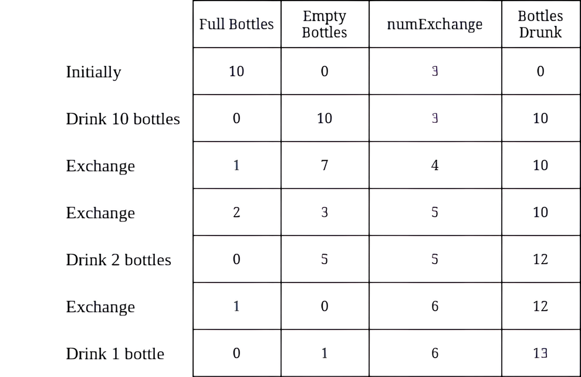

# 换水问题 II

给你两个整数 `numBottles` 和 `numExchange` 。

`numBottles` 代表你最初拥有的满水瓶数量。在一次操作中，你可以执行以下操作之一：

- 喝掉任意数量的满水瓶，使它们变成空水瓶。
- 用 `numExchange` 个空水瓶交换一个满水瓶。然后，将 `numExchange` 的值增加 1 。

注意，你不能使用相同的 `numExchange` 值交换多批空水瓶。例如，如果 `numBottles == 3` 并且 `numExchange == 1` ，则不能用 `3` 个空水瓶交换成 `3` 个满水瓶。

返回你 **最多** 可以喝到多少瓶水。

**示例 1：**


``` javascript
输入：numBottles = 13, numExchange = 6
输出：15
解释：上表显示了满水瓶的数量、空水瓶的数量、numExchange 的值，以及累计喝掉的水瓶数量。
```

**示例 2：**



``` javascript
输入：numBottles = 10, numExchange = 3
输出：13
解释：上表显示了满水瓶的数量、空水瓶的数量、numExchange 的值，以及累计喝掉的水瓶数量。
```

**提示：**

- `1 <= numBottles <= 100 `
- `1 <= numExchange <= 100`

**解答：**

**#**|**编程语言**|**时间（ms / %）**|**内存（MB / %）**|**代码**
------|----------|-----------------|----------------|--------
1|javascript|1 / 36.12|55.93 / 68.72|[朴素方法](./javascript/ac_v1.js)

来源：力扣（LeetCode）

链接：https://leetcode.cn/problems/water-bottles-ii

著作权归领扣网络所有。商业转载请联系官方授权，非商业转载请注明出处。
