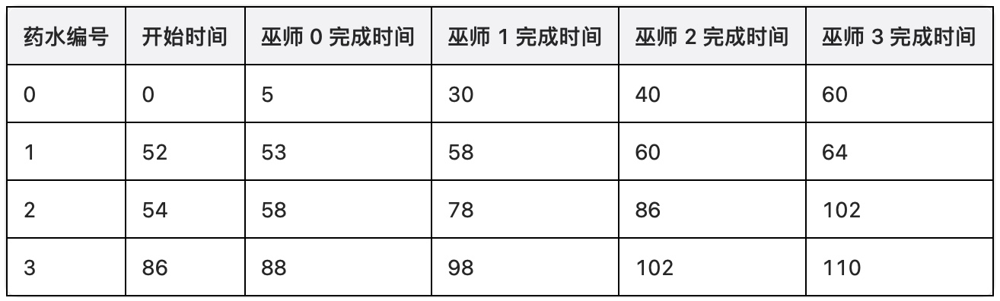

# 酿造药水需要的最少总时间

给你两个长度分别为 `n` 和 `m` 的整数数组 `skill` 和 `mana` 。

在一个实验室里，有 `n` 个巫师，他们必须按顺序酿造 `m` 个药水。每个药水的法力值为 `mana[j]`，并且每个药水 **必须** 依次通过 **所有** 巫师处理，才能完成酿造。第 `i` 个巫师在第 `j` 个药水上处理需要的时间为 `timeij = skill[i] * mana[j]`。

由于酿造过程非常精细，药水在当前巫师完成工作后 **必须** 立即传递给下一个巫师并开始处理。这意味着时间必须保持 **同步**，确保每个巫师在药水到达时 **马上** 开始工作。

返回酿造所有药水所需的 **最短** 总时间。

**示例 1：**

> **输入：** skill = [1,5,2,4], mana = [5,1,4,2]
> 
> **输出：** 110
> 
> **解释：**
> 
> 
> 
> 举个例子，为什么巫师 0 不能在时间 `t = 52` 前开始处理第 1 个药水，假设巫师们在时间 `t = 50` 开始准备第 1 个药水。时间 `t = 58` 时，巫师 2 已经完成了第 1 个药水的处理，但巫师 3 直到时间 `t = 60` 仍在处理第 0 个药水，无法马上开始处理第 1 个药水。

**示例 2：**

> **输入：** skill = [1,1,1], mana = [1,1,1]
> 
> **输出：** 5
> 
> **解释：**
> 
> 1. 第 0 个药水的准备从时间 `t = 0` 开始，并在时间 `t = 3` 完成。
> 2. 第 1 个药水的准备从时间 `t = 1` 开始，并在时间 `t = 4` 完成。
> 3. 第 2 个药水的准备从时间 `t = 2` 开始，并在时间 `t = 5` 完成。

**示例 3：**

> **输入：** skill = [1,2,3,4], mana = [1,2]
> 
> **输出：** 21

**提示：**

- `n == skill.length`
- `m == mana.length`
- `1 <= n, m <= 5000`
- `1 <= mana[i], skill[i] <= 5000`

**解答：**

**#**|**编程语言**|**时间（ms / %）**|**内存（MB / %）**|**代码**
------|----------|-----------------|----------------|--------
1|javascript|453 / 54.24|59.64 / 31.74|[朴素方法](./javascript/ac_v1.js)

来源：力扣（LeetCode）

链接：https://leetcode.cn/problems/find-the-minimum-amount-of-time-to-brew-potions

著作权归领扣网络所有。商业转载请联系官方授权，非商业转载请注明出处。
