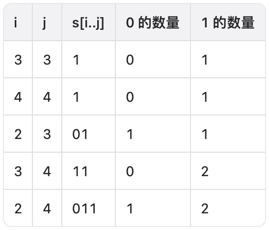
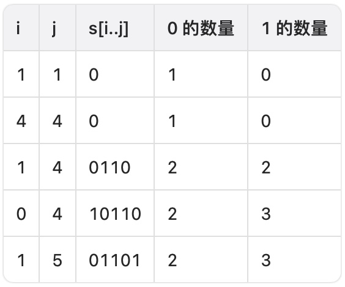

# 统计 1 显著的字符串的数量

给你一个二进制字符串 `s`。

请你统计并返回其中 **1 显著** 的 **子字符串** 的数量。

如果字符串中 1 的数量 **大于或等于 0** 的数量的 **平方**，则认为该字符串是一个 **1 显著** 的字符串 。

**示例 1：**

> **输入：** s = "00011"
> 
> **输出：** 5
> 
> **解释：**
> 
> 1 显著的子字符串如下表所示。
> 
> 
> 

**示例 2：**

> **输入：** s = "101101"
> 
> **输出：** 16
> 
> **解释：**
> 
> 1 不显著的子字符串如下表所示。
> 
> 总共有 21 个子字符串，其中 5 个是 1 不显著字符串，因此有 16 个 1 显著子字符串。
> 
> 
> 

**提示：**

- `1 <= s.length <= 4 * 10^4`
- `s` 仅包含字符 `'0'` 和 `'1'`。

**解答：**

**#**|**编程语言**|**时间（ms / %）**|**内存（MB / %）**|**代码**
------|----------|-----------------|----------------|--------
1|javascript|107 / 80.00|60.92 / 60.00|[遍历&计数](./javascript/ac_v1.js)

来源：力扣（LeetCode）

链接：https://leetcode.cn/problems/count-the-number-of-substrings-with-dominant-ones

著作权归领扣网络所有。商业转载请联系官方授权，非商业转载请注明出处。
