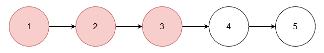
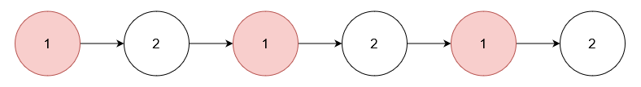

# 从链表中移除在数组中存在的节点

给你一个整数数组 `nums` 和一个链表的头节点 `head`。从链表中 **移除** 所有存在于 `nums` 中的节点后，返回修改后的链表的头节点。

**示例 1：**

> **输入：** nums = [1,2,3], head = [1,2,3,4,5]
> 
> **输出：** [4,5]
> 
> **解释：**
> 
> 
> 
> 移除数值为 1, 2 和 3 的节点。

**示例 2：**

> **输入：** nums = [1], head = [1,2,1,2,1,2]
> 
> **输出：** [2,2,2]
> 
> **解释：**
> 
> 
> 
> 移除数值为 1 的节点。

**示例 3：**

> **输入：** nums = [5], head = [1,2,3,4]
> 
> **输出：** [1,2,3,4]
> 
> **解释：**
> 
> 
> 
> 链表中不存在值为 5 的节点。

**提示：**

- `1 <= nums.length <= 10^5`
- `1 <= nums[i] <= 10^5`
- `nums` 中的所有元素都是唯一的。
- 链表中的节点数在 `[1, 10^5]` 的范围内。
- `1 <= Node.val <= 10^5`
- 输入保证链表中至少有一个值没有在 `nums` 中出现过。

**解答：**

**#**|**编程语言**|**时间（ms / %）**|**内存（MB / %）**|**代码**
------|----------|-----------------|----------------|--------
1|javascript|83 / 46.51|102.46 / 11.63|[哈希](./javascript/ac_v1.js)

来源：力扣（LeetCode）

链接：https://leetcode.cn/problems/delete-nodes-from-linked-list-present-in-array

著作权归领扣网络所有。商业转载请联系官方授权，非商业转载请注明出处。
