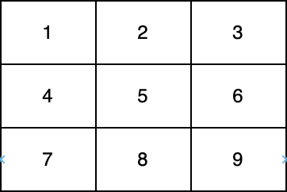

# 对角线上的质数

给你一个下标从 **0** 开始的二维整数数组 `nums` 。

返回位于 `nums` 至少一条 **对角线** 上的最大 **质数** 。如果任一对角线上均不存在质数，返回 *0* 。

注意：

- 如果某个整数大于 `1` ，且不存在除 `1` 和自身之外的正整数因子，则认为该整数是一个质数。
- 如果存在整数 `i` ，使得 `nums[i][i] = val` 或者 `nums[i][nums.length - i - 1]= val` ，则认为整数 `val` 位于 `nums` 的一条对角线上。



在上图中，一条对角线是 **[1,5,9]** ，而另一条对角线是 **[3,5,7]** 。

**示例 1：**

``` javascript
输入：nums = [[1,2,3],[5,6,7],[9,10,11]]
输出：11
解释：数字 1、3、6、9 和 11 是所有 "位于至少一条对角线上" 的数字。由于 11 是最大的质数，故返回 11 。
```

**示例 2：**

``` javascript
输入：nums = [[1,2,3],[5,17,7],[9,11,10]]
输出：17
解释：数字 1、3、9、10 和 17 是所有满足"位于至少一条对角线上"的数字。由于 17 是最大的质数，故返回 17 。
```

**提示：**

- `1 <= nums.length <= 300`
- `nums.length == numsi.length`
- `1 <= nums[i][j] <= 4 * 10^6`

**解答：**

**#**|**编程语言**|**时间（ms / %）**|**内存（MB / %）**|**代码**
--|--|--|--|--
1|javascript|6 / 45.83|61.59 / 12.50|[朴素方法](./javascript/ac_v1.js)

来源：力扣（LeetCode）

链接：https://leetcode.cn/problems/prime-in-diagonal

著作权归领扣网络所有。商业转载请联系官方授权，非商业转载请注明出处。
