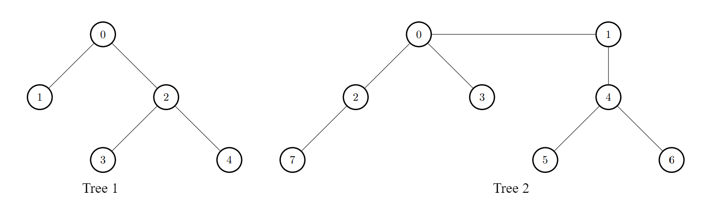

# 连接两棵树后最大目标节点数目 I

有两棵 **无向** 树，分别有 `n` 和 `m` 个树节点。两棵树中的节点编号分别为`[0, n - 1]` 和 `[0, m - 1]` 中的整数。

给你两个二维整数 `edges1` 和 `edges2` ，长度分别为 `n - 1` 和 `m - 1` ，其中 `edges1[i] = [ai, bi]` 表示第一棵树中节点 `ai` 和 `bi` 之间有一条边，`edges2[i] = [ui, vi]` 表示第二棵树中节点 `ui` 和 `vi` 之间有一条边。同时给你一个整数 `k` 。

如果节点 `u` 和节点 `v` 之间路径的边数小于等于 `k` ，那么我们称节点 `u` 是节点 `v` 的 **目标节点** 。**注意** ，一个节点一定是它自己的 **目标节点** 。

请你返回一个长度为 `n` 的整数数组 `answer` ，`answer[i]` 表示将第一棵树中的一个节点与第二棵树中的一个节点连接一条边后，第一棵树中节点 `i` 的 **目标节点** 数目的 **最大值** 。

**注意** ，每个查询相互独立。意味着进行下一次查询之前，你需要先把刚添加的边给删掉。

**示例 1：**

> **输入：** edges1 = [[0,1],[0,2],[2,3],[2,4]], edges2 = [[0,1],[0,2],[0,3],[2,7],[1,4],[4,5],[4,6]], k = 2
> 
> **输出：** [9,7,9,8,8]
> 
> **解释：**
> 
> 对于 i = 0 ，连接第一棵树中的节点 0 和第二棵树中的节点 0 。
> 对于 i = 1 ，连接第一棵树中的节点 1 和第二棵树中的节点 0 。
> 对于 i = 2 ，连接第一棵树中的节点 2 和第二棵树中的节点 4 。
> 对于 i = 3 ，连接第一棵树中的节点 3 和第二棵树中的节点 4 。
> 对于 i = 4 ，连接第一棵树中的节点 4 和第二棵树中的节点 4 。
> 
> 
> 

**示例 2：**

> **输入：** dges1 = [[0,1],[0,2],[0,3],[0,4]], edges2 = [[0,1],[1,2],[2,3]], k = 1
> 
> **输出：** [6,3,3,3,3]
> 
> **解释：**
> 
> 对于每个 i ，连接第一棵树中的节点 i 和第二棵树中的任意一个节点。
> 
> 
> 

**提示：**

- `2 <= n, m <= 1000`
- `edges1.length == n - 1`
- `edges2.length == m - 1`
- `edges1[i].length == edges2[i].length == 2`
- `edges1[i] = [ai, bi]`
- `0 <= ai, bi < n`
- `edges2[i] = [ui, vi]`
- `0 <= ui, vi < m`
- 输入保证 `edges1` 和 `edges2` 都表示合法的树。
- `0 <= k <= 1000`

**解答：**

**#**|**编程语言**|**时间（ms / %）**|**内存（MB / %）**|**代码**
--|--|--|--|--
1|javascript|289 / 0.00|63.54 / 66.67|[等差数列求和](./javascript/ac_v1.js)

来源：力扣（LeetCode）

链接：https://leetcode.cn/problems/maximize-the-number-of-target-nodes-after-connecting-trees-i

著作权归领扣网络所有。商业转载请联系官方授权，非商业转载请注明出处。
