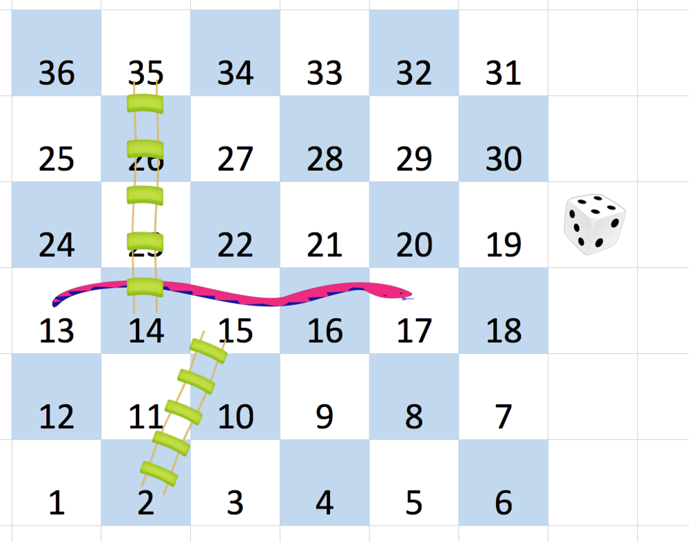

# 蛇梯棋

给你一个大小为 `n x n` 的整数矩阵 `board` ，方格按从 `1` 到 `n^2` 编号，编号遵循 [转行交替方式](https://baike.baidu.com/item/%E7%89%9B%E8%80%95%E5%BC%8F%E8%BD%AC%E8%A1%8C%E4%B9%A6%E5%86%99%E6%B3%95/17195786) ，**从左下角开始** （即，从 `board[n - 1][0]` 开始）的每一行改变方向。

你一开始位于棋盘上的方格 `1`。每一回合，玩家需要从当前方格 `curr` 开始出发，按下述要求前进：

- 选定目标方格 `next` ，目标方格的编号在范围 `[curr + 1, min(curr + 6, n^2)]` 。
  - 该选择模拟了掷 **六面体骰子** 的情景，无论棋盘大小如何，玩家最多只能有 6 个目的地。
- 传送玩家：如果目标方格 `next` 处存在蛇或梯子，那么玩家会传送到蛇或梯子的目的地。否则，玩家传送到目标方格 `next` 。 
- 当玩家到达编号 `n^2` 的方格时，游戏结束。

如果 `board[r][c] != -1` ，位于 `r` 行 `c` 列的棋盘格中可能存在 “蛇” 或 “梯子”。那个蛇或梯子的目的地将会是 `board[r][c]`。编号为 `1` 和 `n^2` 的方格不是任何蛇或梯子的起点。

注意，玩家在每次掷骰的前进过程中最多只能爬过蛇或梯子一次：就算目的地是另一条蛇或梯子的起点，玩家也 **不能** 继续移动。

- 举个例子，假设棋盘是 `[[-1,4],[-1,3]]` ，第一次移动，玩家的目标方格是 `2` 。那么这个玩家将会顺着梯子到达方格 `3` ，但 **不能** 顺着方格 `3` 上的梯子前往方格 `4` 。（简单来说，类似飞行棋，玩家掷出骰子点数后移动对应格数，遇到单向的路径（即梯子或蛇）可以直接跳到路径的终点，但如果多个路径首尾相连，也不能连续跳多个路径）

返回达到编号为 `n^2` 的方格所需的最少掷骰次数，如果不可能，则返回 `-1`。

**示例 1：**



``` javascript
输入：board = [[-1,-1,-1,-1,-1,-1],[-1,-1,-1,-1,-1,-1],[-1,-1,-1,-1,-1,-1],[-1,35,-1,-1,13,-1],[-1,-1,-1,-1,-1,-1],[-1,15,-1,-1,-1,-1]]
输出：4
解释：
首先，从方格 1 [第 5 行，第 0 列] 开始。 
先决定移动到方格 2 ，并必须爬过梯子移动到到方格 15 。
然后决定移动到方格 17 [第 3 行，第 4 列]，必须爬过蛇到方格 13 。
接着决定移动到方格 14 ，且必须通过梯子移动到方格 35 。 
最后决定移动到方格 36 , 游戏结束。 
可以证明需要至少 4 次移动才能到达最后一个方格，所以答案是 4 。
```

**示例 2：**

``` javascript
输入：board = [[-1,-1],[-1,3]]
输出：1
```

**提示：**

- `n == board.length == board[i].length`
- `2 <= n <= 20`
- `board[i][j]` 的值是 `-1` 或在范围 `[1, n^2]` 内
- 编号为 `1` 和 `n^2` 的方格上没有蛇或梯子

**解答：**

**#**|**编程语言**|**时间（ms / %）**|**内存（MB / %）**|**代码**
--|--|--|--|--
1|javascript|?? / ??|?? / ??|[广度优先](./javascript/ac_v1.js)

来源：力扣（LeetCode）

链接：https://leetcode.cn/problems/snakes-and-ladders

著作权归领扣网络所有。商业转载请联系官方授权，非商业转载请注明出处。
