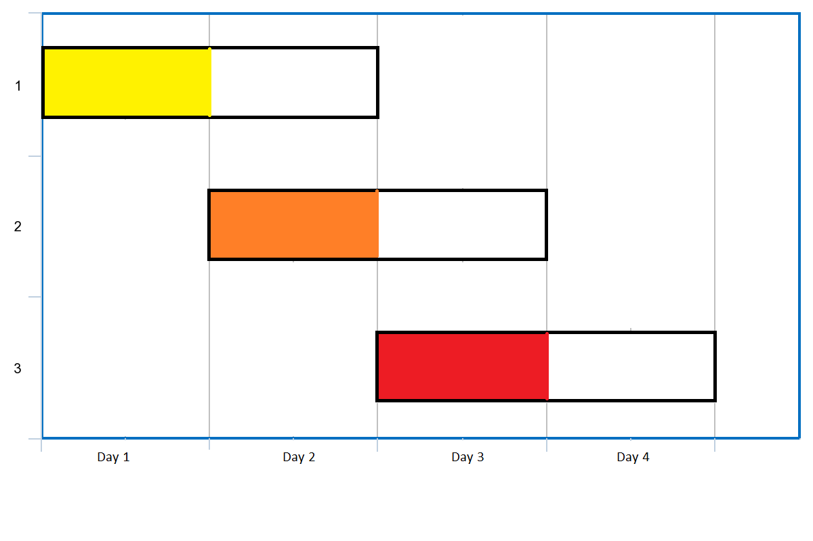

# 最多可以参加的会议数目

给你一个数组 `events`，其中 `events[i] = [startDayi, endDayi]` ，表示会议 `i` 开始于 `startDayi` ，结束于 `endDayi` 。

你可以在满足 `startDayi <= d <= endDayi` 中的任意一天 `d` 参加会议 `i` 。在任意一天 `d` 中只能参加一场会议。

请你返回你可以参加的 **最大** 会议数目。

**示例 1：**



``` javascript
输入：events = [[1,2],[2,3],[3,4]]
输出：3
解释：你可以参加所有的三个会议。
安排会议的一种方案如上图。
第 1 天参加第一个会议。
第 2 天参加第二个会议。
第 3 天参加第三个会议。
```

**示例 2：**

``` javascript
输入：events= [[1,2],[2,3],[3,4],[1,2]]
输出：4
```

**提示：​​​​​​**

- `1 <= events.length <= 10^5`
- `events[i].length == 2`
- `1 <= startDayi <= endDayi <= 10^5`

**解答：**

**#**|**编程语言**|**时间（ms / %）**|**内存（MB / %）**|**代码**
------|----------|-----------------|----------------|--------
1|javascript|142 / 58.33|85.07 / 41.67|[贪心](./javascript/ac_v1.js)

来源：力扣（LeetCode）

链接：https://leetcode.cn/problems/maximum-number-of-events-that-can-be-attended

著作权归领扣网络所有。商业转载请联系官方授权，非商业转载请注明出处。
