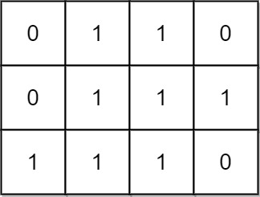

# 统计全 1 子矩形

给你一个 `m x n` 的二进制矩阵 `mat` ，请你返回有多少个 **子矩形** 的元素全部都是 1 。

**示例 1：**



``` javascript
输入：mat = [[1,0,1],[1,1,0],[1,1,0]]
输出：13
解释：
有 6 个 1x1 的矩形。
有 2 个 1x2 的矩形。
有 3 个 2x1 的矩形。
有 1 个 2x2 的矩形。
有 1 个 3x1 的矩形。
矩形数目总共 = 6 + 2 + 3 + 1 + 1 = 13 。
```

**示例 2：**


``` javascript
输入：mat = [[0,1,1,0],[0,1,1,1],[1,1,1,0]]
输出：24
解释：
有 8 个 1x1 的子矩形。
有 5 个 1x2 的子矩形。
有 2 个 1x3 的子矩形。
有 4 个 2x1 的子矩形。
有 2 个 2x2 的子矩形。
有 2 个 3x1 的子矩形。
有 1 个 3x2 的子矩形。
矩形数目总共 = 8 + 5 + 2 + 4 + 2 + 2 + 1 = 24 。
```

**提示：**

- `1 <= m, n <= 150`
- `mat[i][j]` 仅包含 `0` 或 `1`

**解答：**

**#**|**编程语言**|**时间（ms / %）**|**内存（MB / %）**|**代码**
------|----------|-----------------|----------------|--------
1|javascript|?? / ??|?? / ??|[??](./javascript/ac_v1.js)

来源：力扣（LeetCode）

链接：https://leetcode.cn/problems/count-submatrices-with-all-ones

著作权归领扣网络所有。商业转载请联系官方授权，非商业转载请注明出处。
