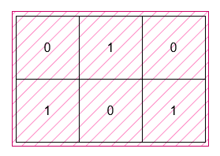

# 包含所有 1 的最小矩形面积 I

给你一个二维 **二进制** 数组 `grid`。请你找出一个边在水平方向和竖直方向上、面积 **最小** 的矩形，并且满足 `grid` 中所有的 1 都在矩形的内部。

返回这个矩形可能的 **最小** 面积。

**示例 1：**

> **输入：** grid = [[0,1,0],[1,0,1]]
> 
> **输出：** 6
> 
> **解释：**
> 
> 
> 
> 这个最小矩形的高度为 2，宽度为 3，因此面积为 `2 * 3 = 6`。

**示例 2：**

> **输入：** grid = [[0,0],[1,0]]
> 
> **输出：** 1
> 
> **解释：**
> 
> 
> 
> 这个最小矩形的高度和宽度都是 1，因此面积为 `1 * 1 = 1`。

**提示：**

- `1 <= grid.length, grid[i].length <= 1000`
- `grid[i][j]` 是 0 或 1。
- 输入保证 `grid` 中至少有一个 1 。

**解答：**

**#**|**编程语言**|**时间（ms / %）**|**内存（MB / %）**|**代码**
------|----------|-----------------|----------------|--------
1|javascript|8 / 60.00|87.41 / 53.33|[朴素方法](./javascript/ac_v1.js)

来源：力扣（LeetCode）

链接：https://leetcode.cn/problems/find-the-minimum-area-to-cover-all-ones-i

著作权归领扣网络所有。商业转载请联系官方授权，非商业转载请注明出处。
