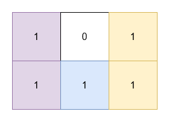

# 包含所有 1 的最小矩形面积 II

给你一个二维 **二进制** 数组 `grid`。你需要找到 3 个 **不重叠**、面积 **非零** 、边在水平方向和竖直方向上的矩形，并且满足 `grid` 中所有的 1 都在这些矩形的内部。

返回这些矩形面积之和的 **最小** 可能值。

**注意**，这些矩形可以相接。

**示例 1：**

> 输入： grid = [[1,0,1],[1,1,1]]
> 
> 输出： 5
> 
> 解释：
> 
> 
> 
> - 位于 `(0, 0)` 和 `(1, 0)` 的 1 被一个面积为 2 的矩形覆盖。
> - 位于 `(0, 2)` 和 `(1, 2)` 的 1 被一个面积为 2 的矩形覆盖。
> - 位于 `(1, 1)` 的 1 被一个面积为 1 的矩形覆盖。

**示例 2：**

> 输入： grid = [[1,0,1,0],[0,1,0,1]]
> 
> 输出： 5
> 
> 解释：
> 
> 
> 
> - 位于 `(0, 0)` 和 `(0, 2)` 的 1 被一个面积为 3 的矩形覆盖。
> - 位于 `(1, 1)` 的 1 被一个面积为 1 的矩形覆盖。
> - 位于 `(1, 3)` 的 1 被一个面积为 1 的矩形覆盖。

**提示：**

- `1 <= grid.length, grid[i].length <= 30`
- `grid[i][j]` 是 0 或 1。
- 输入保证 `grid` 中至少有三个 1 。

**解答：**

**#**|**编程语言**|**时间（ms / %）**|**内存（MB / %）**|**代码**
------|----------|-----------------|----------------|--------
1|javascript|?? / ??|?? / ??|[分类](./javascript/ac_v1.js)

来源：力扣（LeetCode）

链接：https://leetcode.cn/problems/find-the-minimum-area-to-cover-all-ones-ii

著作权归领扣网络所有。商业转载请联系官方授权，非商业转载请注明出处。
