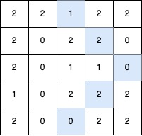
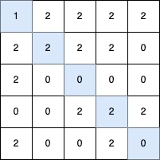

# 最长 V 形对角线段的长度

给你一个大小为 `n x m` 的二维整数矩阵 `grid`，其中每个元素的值为 `0`、`1` 或 `2`。

**V 形对角线段** 定义如下：

- 线段从 `1` 开始。
- 后续元素按照以下无限序列的模式排列：`2, 0, 2, 0, ...`。
- 该线段：
  - 起始于某个对角方向（左上到右下、右下到左上、右上到左下或左下到右上）。
  - 沿着相同的对角方向继续，保持 **序列模式** 。
  - 在保持 **序列模式** 的前提下，最多允许 **一次顺时针 90 度转向** 另一个对角方向。

返回最长的 **V 形对角线段** 的 **长度** 。如果不存在有效的线段，则返回 0。

**示例 1：**

> **输入：** grid = [[2,2,1,2,2],[2,0,2,2,0],[2,0,1,1,0],[1,0,2,2,2],[2,0,0,2,2]]
> 
> **输出：** 5
> 
> **解释：**
> 
> 
> 
> 最长的 V 形对角线段长度为 5，路径如下：`(0,2) → (1,3) → (2,4)`，在 `(2,4)` 处进行 **顺时针 90 度转向** ，继续路径为 `(3,3) → (4,2)`。

**示例 2：**

> **输入：** grid = [[2,2,2,2,2],[2,0,2,2,0],[2,0,1,1,0],[1,0,2,2,2],[2,0,0,2,2]]
> 
> **输出：** 4
> 
> **解释：**
> 
> 
> 
> 最长的 V 形对角线段长度为 4，路径如下：`(2,3) → (3,2)`，在 `(3,2)` 处进行 **顺时针 90 度转向** ，继续路径为 `(2,1) → (1,0)`。

**示例 3：**

> **输入：** grid = [[1,2,2,2,2],[2,2,2,2,0],[2,0,0,0,0],[0,0,2,2,2],[2,0,0,2,0]]
> 
> **输出：** 5
> 
> **解释：**
> 
> 
> 
> 最长的 V 形对角线段长度为 5，路径如下：`(0,0) → (1,1) → (2,2) → (3,3) → (4,4)`。

**示例 4：**

> **输入：** grid = [[1]]
> 
> **输出：** 1
> 
> **解释：**
> 
> 最长的 V 形对角线段长度为 1，路径如下：`(0,0)`。

**提示：**

- `n == grid.length`
- `m == grid[i].length`
- `1 <= n, m <= 500`
- `grid[i][j]` 的值为 `0`、`1` 或 `2`。

**解答：**

**#**|**编程语言**|**时间（ms / %）**|**内存（MB / %）**|**代码**
------|----------|-----------------|----------------|--------
1|javascript|?? / ??|?? / ??|[记忆化搜索](./javascript/ac_v1.js)

来源：力扣（LeetCode）

链接：https://leetcode.cn/problems/length-of-longest-v-shaped-diagonal-segment

著作权归领扣网络所有。商业转载请联系官方授权，非商业转载请注明出处。
