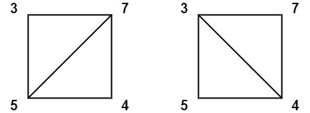

# 多边形三角剖分的最低得分

你有一个凸的 `n` 边形，其每个顶点都有一个整数值。给定一个整数数组 `values` ，其中 `values[i]` 是第 `i` 个顶点的值（即 **顺时针顺序** ）。

假设将多边形 **剖分** 为 `n - 2` 个三角形。对于每个三角形，该三角形的值是顶点标记的 **乘积**，三角剖分的分数是进行三角剖分后所有 `n - 2` 个三角形的值之和。

返回 *多边形进行三角剖分后可以得到的最低分* 。

**示例 1：**


``` javascript
输入：values = [1,2,3]
输出：6
解释：多边形已经三角化，唯一三角形的分数为 6。
```

**示例 2：**



``` javascript
输入：values = [3,7,4,5]
输出：144
解释：有两种三角剖分，可能得分分别为：3*7*5 + 4*5*7 = 245，或 3*4*5 + 3*4*7 = 144。最低分数为 144。
```

**示例 3：**


``` javascript
输入：values = [1,3,1,4,1,5]
输出：13
解释：最低分数三角剖分的得分情况为 1*1*3 + 1*1*4 + 1*1*5 + 1*1*1 = 13。
```

**提示：**

- `n == values.length`
- `3 <= n <= 50`
- `1 <= values[i] <= 100`

**解答：**

**#**|**编程语言**|**时间（ms / %）**|**内存（MB / %）**|**代码**
------|----------|-----------------|----------------|--------
1|javascript|5 / 85.91|55.68 / 75.91|[记忆化搜索&&动态规划](./javascript/ac_v1.js)

来源：力扣（LeetCode）

链接：https://leetcode.cn/problems/minimum-score-triangulation-of-polygon

著作权归领扣网络所有。商业转载请联系官方授权，非商业转载请注明出处。
