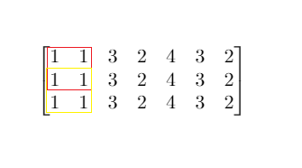

# 元素和小于等于阈值的正方形的最大边长

给你一个大小为 `m x n` 的矩阵 `mat` 和一个整数阈值 `threshold`。

请你返回元素总和小于或等于阈值的正方形区域的最大边长；如果没有这样的正方形区域，则返回 **0** 。

**示例 1：**



``` javascript
输入：mat = [[1,1,3,2,4,3,2],[1,1,3,2,4,3,2],[1,1,3,2,4,3,2]], threshold = 4
输出：2
解释：总和小于或等于 4 的正方形的最大边长为 2，如图所示。
```

**示例 2：**

``` javascript
输入：mat = [[2,2,2,2,2],[2,2,2,2,2],[2,2,2,2,2],[2,2,2,2,2],[2,2,2,2,2]], threshold = 1
输出：0
```

**提示：**

- `m == mat.length`
- `n == mat[i].length`
- `1 <= m, n <= 300`
- `0 <= mat[i][j] <= 10^4`
- `0 <= threshold <= 10^5`

**解答：**

**#**|**编程语言**|**时间（ms / %）**|**内存（MB / %）**|**代码**
--|--|--|--|--
1|javascript|118 / 33.33|62.57 / 40.00|[前缀和](./javascript/ac_v1.js)
2|javascript|14 / 100.00|62.84 / 40.00|[前缀和&&二分](./javascript/ac_v2.js)

来源：力扣（LeetCode）

链接：https://leetcode.cn/problems/maximum-side-length-of-a-square-with-sum-less-than-or-equal-to-threshold

著作权归领扣网络所有。商业转载请联系官方授权，非商业转载请注明出处。
