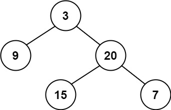
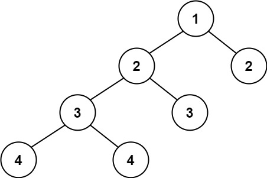

# 平衡二叉树

给定一个二叉树，判断它是否是 **平衡二叉树**

**示例 1：**



``` javascript
输入：root = [3,9,20,null,null,15,7]
输出：true
```

**示例 2：**



``` javascript
输入：root = [1,2,2,3,3,null,null,4,4]
输出：false
```

**示例 3：**

``` javascript
输入：root = []
输出：true
```

**提示：**

- 树中的节点数在范围 `[0, 5000]` 内
- `-10^4 <= Node.val <= 10^4`

**解答：**

**#**|**编程语言**|**时间（ms / %）**|**内存（MB / %）**|**代码**
--|--|--|--|--
1|javascript|1 / 92.86|59.11 / 50.73|[后序遍历](./javascript/ac_v1.js)

来源：力扣（LeetCode）

链接：https://leetcode.cn/problems/balanced-binary-tree

著作权归领扣网络所有。商业转载请联系官方授权，非商业转载请注明出处。
