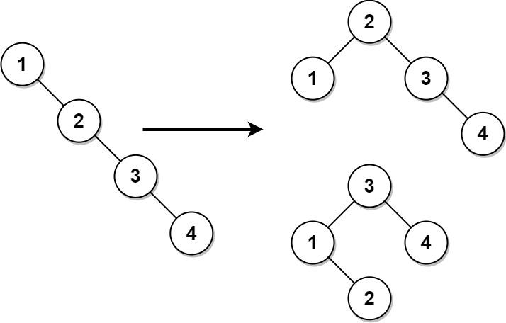
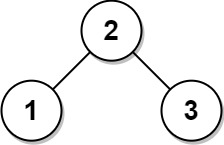

# 将二叉搜索树变平衡

给你一棵二叉搜索树，请你返回一棵 **平衡后** 的二叉搜索树，新生成的树应该与原来的树有着相同的节点值。如果有多种构造方法，请你返回任意一种。

如果一棵二叉搜索树中，每个节点的两棵子树高度差不超过 `1` ，我们就称这棵二叉搜索树是 **平衡的** 。

**示例 1：**



``` javascript
输入：root = [1,null,2,null,3,null,4,null,null]
输出：[2,1,3,null,null,null,4]
解释：这不是唯一的正确答案，[3,1,4,null,2,null,null] 也是一个可行的构造方案。
```

**示例 2：**



``` javascript
输入: root = [2,1,3]
输出: [2,1,3]
```

**提示：**

- 树节点的数目在 `[1, 10^4]` 范围内。
- `1 <= Node.val <= 10^5`

**解答：**

**#**|**编程语言**|**时间（ms / %）**|**内存（MB / %）**|**代码**
--|--|--|--|--
1|javascript|7 / 73.81|73.26 / 69.05|[后序遍历](./javascript/ac_v1.js)

来源：力扣（LeetCode）

链接：https://leetcode.cn/problems/balance-a-binary-search-tree

著作权归领扣网络所有。商业转载请联系官方授权，非商业转载请注明出处。
