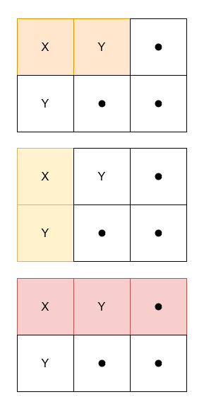

# 统计 X 和 Y 频数相等的子矩阵数量

给你一个二维字符矩阵 `grid`，其中 `grid[i][j]` 可能是 `'X'`、`'Y'` 或 `'.'`，返回满足以下条件的 **子矩阵** 数量：
- 包含 `grid[0][0]`
- `'X'` 和 `'Y'` 的频数相等。
- 至少包含一个 `'X'`。

**示例 1：**

> **输入：** grid = [["X","Y","."],["Y",".","."]]
> 
> **输出：** 3
> 
> **解释：**
> 
> 
> 

**示例 2：**

> **输入：** grid = [["X","X"],["X","Y"]]
> 
> **输出：** 0
> 
> **解释：**
> 
> 不存在满足 `'X'` 和 `'Y'` 频数相等的子矩阵。

**示例 3：**

> **输入：** grid = [[".","."],[".","."]]
> 
> **输出：** 0
> 
> **解释：**
> 
> 不存在满足至少包含一个 `'X'` 的子矩阵。

**提示：**

- `1 <= grid.length, grid[i].length <= 1000`
- `grid[i][j]` 可能是 `'X'`、`'Y'` 或 `'.'`.

**解答：**

**#**|**编程语言**|**时间（ms / %）**|**内存（MB / %）**|**代码**
--|--|--|--|--
1|javascript|763 / 40.00|150.99 / 60.00|[前缀和](./javascript/ac_v1.js)

来源：力扣（LeetCode）

链接：https://leetcode.cn/problems/count-submatrices-with-equal-frequency-of-x-and-y

著作权归领扣网络所有。商业转载请联系官方授权，非商业转载请注明出处。
