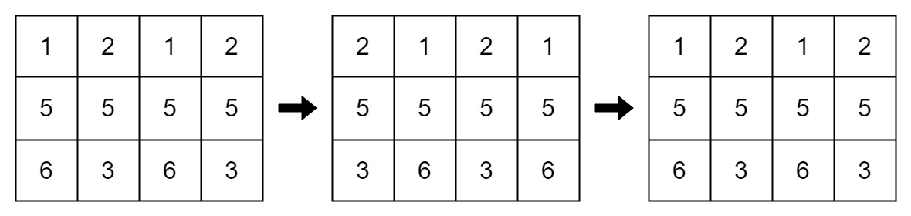

# 循环移位后的矩阵相似检查

给你一个 **下标从 0 开始** 且大小为 `m x n` 的整数矩阵 `mat` 和一个整数 `k` 。矩阵行的下标是从 0 开始的。

进行下面操作 `k` 次：
- **偶数行**（0, 2, 4, ...）循环向左移动。

- **奇数行**（1, 3, 5, ...）循环向右移动。

如果经过 `k` 步后的最终修改矩阵与原始矩阵相同，则返回 `true`，否则返回 `false`。

**示例 1：**

> **输入：** mat = [[1,2,3],[4,5,6],[7,8,9]], k = 4
> 
> **输出：** false
> 
> **解释：**
> 
> 在每一步中，行 0 和行 2（偶数下标）进行左移，行 1（奇数下标）进行右移。
> 
> 
> 

**示例 2：**

> **输入：** mat = [[1,2,1,2],[5,5,5,5],[6,3,6,3]], k = 2
> 
> **输出：** true
> 
> **解释：**
> 
> 
> 

**示例 3：**

> **输入：** mat = [[2,2],[2,2]], k = 3
> 
> **输出：** true
> 
> **解释：**
> 
> 矩阵中的所有值都相等，即使进行循环移位，矩阵也会保持不变。

**提示：**

- `1 <= mat.length <= 25`
- `1 <= mat[i].length <= 25`
- `1 <= mat[i][j] <= 25`
- `1 <= k <= 50`

**解答：**

**#**|**编程语言**|**时间（ms / %）**|**内存（MB / %）**|**代码**
--|--|--|--|--
1|javascript|1 / 80.00|56.16 / 80.00|[朴素方法](./javascript/ac_v1.js)

来源：力扣（LeetCode）

链接：https://leetcode.cn/problems/matrix-similarity-after-cyclic-shifts

著作权归领扣网络所有。商业转载请联系官方授权，非商业转载请注明出处。
