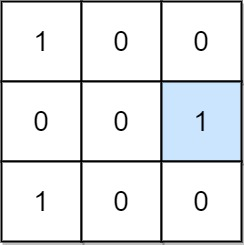
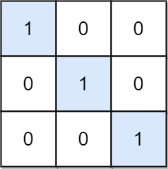

# 二进制矩阵中的特殊位置

给定一个 `m x n` 的二进制矩阵 `mat`，返回矩阵 `mat` 中特殊位置的数量。

如果位置 `(i, j)` 满足 `mat[i][j] == 1` 并且行 `i` 与列 `j` 中的所有其他元素都是 `0`（行和列的下标从 **0** 开始计数），那么它被称为 **特殊** 位置。

**示例 1：**



``` javascript
输入：mat = [[1,0,0],[0,0,1],[1,0,0]]
输出：1
解释：位置 (1, 2) 是一个特殊位置，因为 mat[1][2] == 1 且第 1 行和第 2 列的其他所有元素都是 0。
```

**示例 2：**



``` javascript
输入：mat = [[1,0,0],[0,1,0],[0,0,1]]
输出：3
解释：位置 (0, 0)，(1, 1) 和 (2, 2) 都是特殊位置。
```

**提示：**

- `m == mat.length`
- `n == mat[i].length`
- `1 <= m, n <= 100`
- `mat[i][j]` 是 `0` 或 `1`。

**解答：**

**#**|**编程语言**|**时间（ms / %）**|**内存（MB / %）**|**代码**
--|--|--|--|--
1|javascript|1 / 88.89|56.23 / 77.78|[朴素方法](./javascript/ac_v1.js)

来源：力扣（LeetCode）

链接：https://leetcode.cn/problems/special-positions-in-a-binary-matrix

著作权归领扣网络所有。商业转载请联系官方授权，非商业转载请注明出处。
