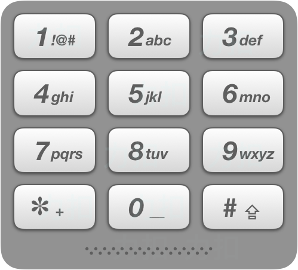

# 电话号码的字母组合

给定一个仅包含数字 2-9 的字符串，返回所有它能表示的字母组合。

给出数字到字母的映射如下（与电话按键相同）。注意 1 不对应任何字母。



**示例:**

``` javascript
输入："23"
输出：["ad", "ae", "af", "bd", "be", "bf", "cd", "ce", "cf"].
说明:
尽管上面的答案是按字典序排列的，但是你可以任意选择答案输出的顺序。
```

**解答：**

**#**|**编程语言**|**时间（ms / %）**|**内存（MB / %）**|**代码**
--|--|--|--|--
1|javascript|100 / 5.52|37.5 / 65.28|[深度优先](./javascript/ac_v1.js)
2|javascript|92 / 14.30|37.6 / 52.14|[广度优先](./javascript/ac_v2.js)

来源：力扣（LeetCode）

链接：https://leetcode-cn.com/problems/letter-combinations-of-a-phone-number

著作权归领扣网络所有。商业转载请联系官方授权，非商业转载请注明出处。
