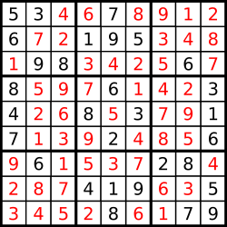

# 37. 解数独

编写一个程序，通过已填充的空格来解决数独问题。

一个数独的解法需**遵循如下规则：**

- 数字 1-9 在每一行只能出现一次。
- 数字 1-9 在每一列只能出现一次。
- 数字 1-9 在每一个以粗实线分隔的 3x3 宫内只能出现一次。

空白格用 '.' 表示。

一个数独。

答案被标成红色。

**Note:**

- 给定的数独序列只包含数字 1-9 和字符 '.' 。
- 你可以假设给定的数独只有唯一解。
- 给定数独永远是 9x9 形式的。

**解答：**

**#**|**编程语言**|**时间（ms / %）**|**内存（MB / %）**|**代码**
--|--|--|--|--
1|javascript|76 / 70.50|38.4 / 5.29|[深度优先&状态压缩](./javascript/ac_v1.js)

来源：力扣（LeetCode）

链接：https://leetcode-cn.com/problems/sudoku-solver

著作权归领扣网络所有。商业转载请联系官方授权，非商业转载请注明出处。
