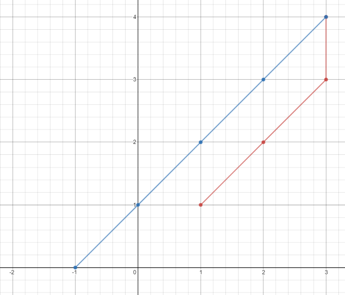

# 访问所有点的最小时间

平面上有 n 个点，点的位置用整数坐标表示 points[i] = [xi, yi]。请你计算访问所有这些点需要的最小时间（以秒为单位）。

你可以按照下面的规则在平面上移动：

每一秒沿水平或者竖直方向移动一个单位长度，或者跨过对角线（可以看作在一秒内向水平和竖直方向各移动一个单位长度）。
必须按照数组中出现的顺序来访问这些点。

示例 1：



``` javascript
输入：points = [[1,1],[3,4],[-1,0]]
输出：7
解释：一条最佳的访问路径是： [1,1] -> [2,2] -> [3,3] -> [3,4] -> [2,3] -> [1,2] -> [0,1] -> [-1,0]   
从 [1,1] 到 [3,4] 需要 3 秒 
从 [3,4] 到 [-1,0] 需要 4 秒
一共需要 7 秒
```

示例 2：

``` javascript
输入：points = [[3,2],[-2,2]]
输出：5
```

提示：

- points.length == n
- 1 <= n <= 100
- points[i].length == 2
- -1000 <= points[i][0], points[i][1] <= 1000
